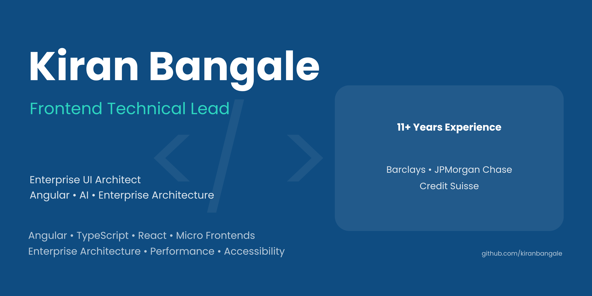

  

# Hi there 👋 I'm Kiran Bangale

## Frontend Technical Lead | Enterprise UI Architect | AI-Driven Frontend Engineer

I am a Frontend Technical Lead with 11+ years of experience building enterprise-scale web applications for global financial institutions including Barclays, JPMorgan Chase and Credit Suisse.

My expertise lies in designing scalable, high-performance frontend applications using Angular, TypeScript and modern frontend architecture. I enjoy solving complex UI challenges, improving application performance and building intuitive user experiences.

### 💼 Currently working on

- Enterprise Risk Management Platform (Barclays)
- Angular Micro Frontends
- High Performance Data Grids & Dashboards
- AI-powered Dashboard Generation POC
- Modern Frontend Architecture

### 🛠 Tech Stack

**Frontend**
- Angular
- React
- Next.js
- TypeScript
- JavaScript
- HTML5
- CSS3
- SCSS
- Tailwind CSS

**Enterprise UI**
- AG Grid
- AG Charts
- Ignite UI
- RxJS
- Redux

**Architecture**
- Micro Frontends
- Performance Engineering
- Accessibility (WCAG 2.2)
- REST APIs
- Design Systems

**Cloud & DevOps**
- AWS
- Docker
- GitHub
- GitLab
- Jenkins
- OpenShift

**Currently Learning**
- AI Engineering
- Prompt Engineering
- Model Context Protocol (MCP)
- Enterprise AI Applications

### 🏆 Highlights

- 11+ years in Frontend Engineering
- Barclays • JPMorgan Chase • Credit Suisse
- Frontend owner of Risk Desktop Core
- Technical Lead
- AI Dashboard Generation POC
- Performance Optimization
- Enterprise UI Architecture

### 📫 Connect with me

- LinkedIn: https://www.linkedin.com/in/kiranbangale
- Portfolio: https://kiranbangale.github.io
